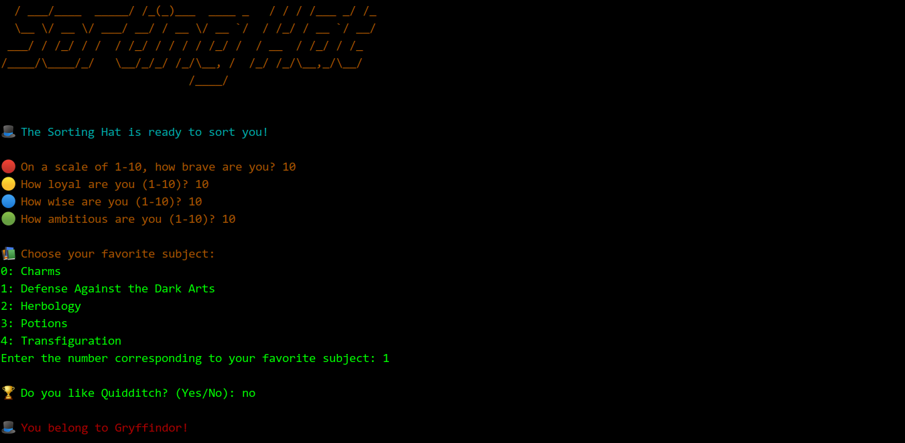

---

# Sorting Hat using K-Neighbors Classifier

A fun Python project where the **Sorting Hat** sorts users into Hogwarts houses based on their personality traits using a **K-Neighbors Classifier**.

### Features:
- **Data-driven Sorting**: Based on a dataset of Hogwarts characters, including attributes like bravery, loyalty, wisdom, ambition, and favorite subject.
- **Interactive Command-Line Interface (TUI)**: Users input their traits, and the Sorting Hat predicts which Hogwarts house they belong to.
- **Customizable**: You can easily modify the dataset (CSV) to add more characters or features.
- **Colorful Console**: The TUI is designed to be engaging and fun with color-coded output for each house.

---

## Requirements

Before running the project, ensure you have the required Python libraries:

- **Python 3.x**
- **scikit-learn**
- **pandas**
- **pyfiglet**
- **colorama**

You can install these using pip:

```bash
pip install scikit-learn pandas pyfiglet colorama
```

---

## How to Run

1. **Clone the repository** (or download the files):

   ```bash
   git clone https://github.com/orionaraf/the-sorting-hat.git
   cd the_sorting_hat
   ```

2. **Prepare the Dataset**:

   - Ensure you have the **dataset.csv** file containing Hogwarts characters and their attributes like bravery, loyalty, wisdom, ambition, and favorite subject.

3. **Run the program**:

   ```bash
   python main.py
   ```

   This will start the Sorting Hat quiz where you will be prompted to input your traits, favorite subject, and whether you're a Quidditch fan. Based on your inputs, the Sorting Hat will predict your Hogwarts house.

---

## How It Works

1. **Dataset**:
   The dataset contains a list of Hogwarts characters with attributes like bravery, loyalty, wisdom, ambition, and favorite subject. This data is used to train the **KNeighborsClassifier**.

2. **Model Training**:
   The **KNeighborsClassifier** is trained using the features (bravery, loyalty, wisdom, ambition, favorite subject, and Quidditch fan) and the target (house).

3. **User Input**:

   - The program asks the user for inputs: bravery, loyalty, wisdom, ambition, favorite subject, and Quidditch fandom.
   - The inputs are processed and passed through the trained model to predict the user's Hogwarts house.

4. **Prediction**:
   The model predicts one of the four Hogwarts houses (**Gryffindor**, **Slytherin**, **Ravenclaw**, or **Hufflepuff**) based on the user's input.

---

## Example

Here’s an example of how the interaction looks in the terminal:

```
🎩 The Sorting Hat is ready to sort you!

🔴 On a scale of 1-10, how brave are you? 8
🟡 How loyal are you (1-10)? 7
🔵 How wise are you (1-10)? 9
🟢 How ambitious are you (1-10)? 6

📚 Choose your favorite subject:
0: Defense Against the Dark Arts
1: Charms
2: Herbology
3: Potions
4: Transfiguration
5: Divination
Enter the number corresponding to your favorite subject: 0

🏆 Do you like Quidditch? (Yes/No): yes

🎩 You belong to Gryffindor!
```

---

## Customizing the Dataset

1. To add or change the characters in the dataset, open the `dataset.csv` file and modify the rows.
2. You can update the features (e.g., bravery, loyalty) or even add new ones, but make sure they are consistent when prompting the user.

---

```markdown
## Screenshot

Below is a screenshot showing the Sorting Hat in action:


```

---

## Notes

- The model uses **K-Neighbors Classifier**, which is a simple and effective algorithm for classification problems like this.
- Make sure to **preprocess** categorical data like favorite subject and Quidditch fan by encoding them into numerical values for the model.
- The `pandas` library is used for data manipulation, and `colorama` is used to add color to the output in the terminal.
- The **pyfiglet** library is used to print the Sorting Hat title in a fun, ASCII style.

---

### Enjoy being sorted into your Hogwarts house! 🎩✨

---
